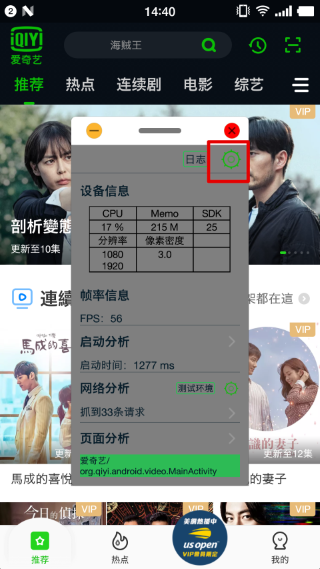
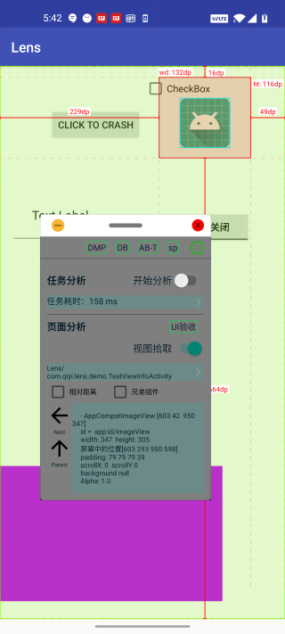
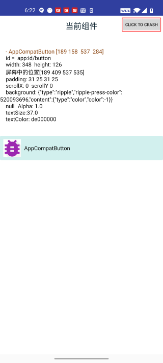
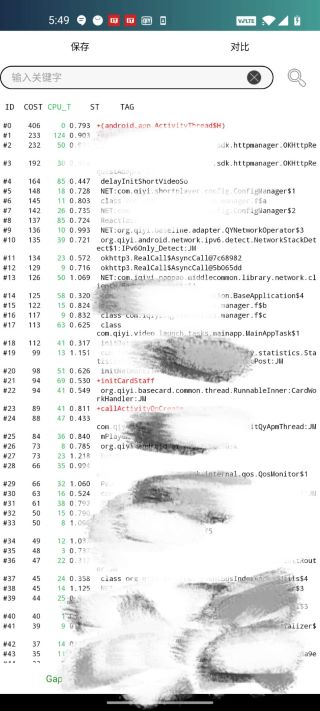
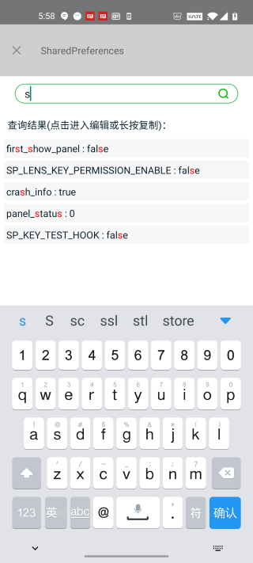
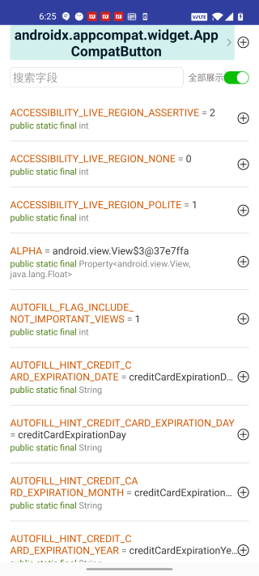

Lens
=======

### 简介（wiki 完善中）  
Lens 是一款功能强大的Android开发SDK。目前支持界面分析，任务分析, 网络分析，DataDump，DataExplorer等等功能。网络分析、任务分析等功能需要依赖hook框架。Lens 自身不支持hook能力，需注入Lens Hook Framework  实现后，才可使用hook相关的功能。  

Lens 是一个开放平台，任何可以为产品开发阶段赋能的创意，都可以作为一个独立的模块向里面添加。  
Lens 是一个框架，它提供了将app 内部数据直观展示出来的方案，也提供了若干接口，让APP 层可以定制展示自己需要的内容。（后面的wiki再进一步说明）  

Lens自18年8月创建，我们旨在为开发、测试、UI 赋能。Lens并不完善，代码也有待优化，欢迎小伙伴们提出建议。

##### 基础功能简介(详情见wiki)  
Lens 是以浮窗形式展示在APP 上的。支持最小化模式、展开模式、关闭模式。浮窗可以在界面中随意拖动。浮窗中的任何一个功能模块，都支持在设置中打开或关闭，也可以在初始化代码中配置。 



###### 界面分析  
* 页面信息：展示页面的基本信息，如当前Activity、Fragment 嵌套关系等。展示页面视图层级关系、分析页面视图情况等。
* 视图拾取：打开视图拾取开关后，点击页面视图，可选中视图。在界面上将会展示视图的基本信息，例如尺寸标注。控件的关键属性等。点击控件，可进入视图详情页面，进一步分析。


###### 任务分析  
Lens 提供了接口，支持展示任一阶段内的任务执行的情况。支持Time Gap、Time Stamp，Threads Info信息展示。

###### 网络分析 
Lens 提供了接口，支持抓取到的网络请求信息。支持设置测试环境等。

###### DataExplorer  
入口再Lens 浮窗`DB`, `SP`. 目前支持查看本app DB、SP 信息。 支持修改SP 数据。

###### DataDump  
Lens 提供了接口，支持app的一些内部数据展示能力。用于更好的去分析、定位问题。Lens 内部实现了一些基本的数据dump 能力。也支持app 层自己实现定制化的data dump 数据对接。内部文件浏览功能正在开发中。


###### 对象监控  
Lens  支持关注任意对象。被关注的对象将会再浮窗模块中显示。点击对象可查看该对象的属性信息


#### Setup  
```Groovy
dependencies {
    debugImplementation "qiyi.lens:qylens:1.0.5}"
    releaseImplementation "qiyi.lens:qylens-no-op:1.0.5"
}
```

#### Usage

可参考Demo 中LensApplicationDelegate 实现配置。（Wiki 中会详细说明方法含义）

```Java
LensUtil.buildConfig()
                .defaultOpen(false)
//                .enableDeviceInfo(true)
//                .enableKeyLog(KeyLogConfig.builder().addFilter("Main").setMaxLine(1000))
//                .enableFPS(true)
//                .enableLaunchTime(true)
//                .setHookFrameWorkImpl(new HookFramework())
                .enableActivityAnalyzer(true)
                .enableNetworkAnalyze(false)
                .enableCrashInfo(true)
                .addCustomBlockEntrance(customBlockEntrance, new BlockFactory())
                .addCustomJumpEntrance(customJumpEntrance, new JumpAction())
                .initAsPluginMode(Lens.isSDKMode())
                .enableViewInfo(true)
                .show(Lens.wrapContext(mApplication), UIUtils.getScreenWidth(mApplication) / 5 * 3);
```

#### License  
Apache-2.0 License